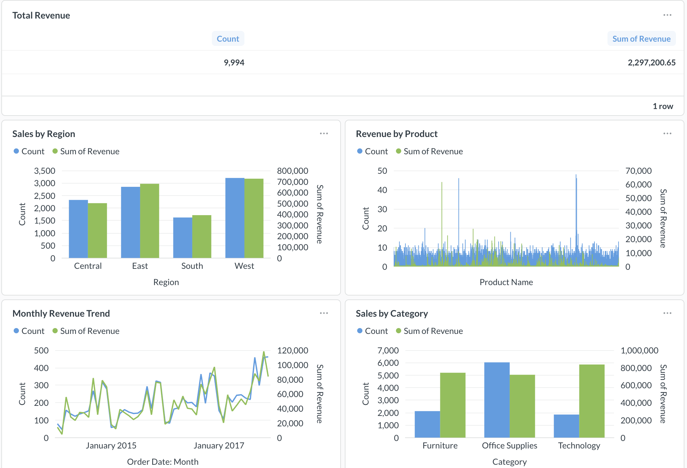

# Automated Retail Sales Analytics Pipeline

An end-to-end data engineering project: ingest retail sales data from an API and
CSV files, transform and validate it, load it into PostgreSQL, orchestrate daily
runs with Airflow, and test everything with GitHub Actions CI/CD.

Built level-by-level as a portfolio piece for Data Analyst / Data Engineer roles.

## Interview pitch (the 30-second version)

> I built an end-to-end retail sales analytics pipeline. It ingests data from a
> CSV and a REST API, cleans and validates it in Python (pandas), and loads it
> into PostgreSQL — implemented both as **ETL** (transform-then-load) and **ELT**
> (load-then-transform in SQL). Apache **Airflow** orchestrates the four stages
> on a daily schedule, and every run is logged to a metadata table for
> observability. The whole thing is covered by **GitHub Actions CI/CD**: pytest
> runs on every push, and on success a **Docker image** of the pipeline is built
> and published to the GitHub Container Registry. Finally, a **Metabase**
> dashboard sits on top of Postgres surfacing the KPIs — total revenue, revenue
> by product, sales by category and region, and the monthly trend. It's free,
> reproducible, and runs identically on any machine via the container.

## Architecture (final goal)

```
CSV + API  ->  Extract  ->  Transform + Validate  ->  Load (PostgreSQL)
                                                          |
                              Airflow (schedule) ---------+
                              GitHub Actions:
                                CI  -> pytest on every push
                                CD  -> build & publish Docker image (ghcr.io)
                              Dashboard (KPIs)
```

## Build levels

| Level | Stage | Status |
|-------|-------|--------|
| 1 | Extract (CSV + Fake Store API -> `data/raw/`) | ✅ done (`v1.0.0`) |
| 2 | ETL: transform, validate & load into PostgreSQL + metadata logging | ✅ done (`v2.0.0`) |
| 3 | ELT: load raw to Postgres, then transform + build KPI tables in SQL | ✅ done (`v3.0.0`) |
| 4 | Orchestration: Airflow DAG runs extract→transform→validate→load @daily | ✅ done (`v4.0.0`) |
| 5 | CI/CD: GitHub Actions runs pytest, then builds & publishes a Docker image | ✅ done (`v5.0.0`) |
| 6 | Dashboard: Metabase on Postgres with revenue/product/region/category/trend KPIs | ✅ done (`v6.0.0`) |

## Data sources

- **Superstore sales** (Kaggle CSV) — `data/raw/superstore_sales.csv`
- **Fake Store API** (https://fakestoreapi.com) — `data/raw/fakestore_products.json`

## Setup

```bash
python3 -m venv .venv
source .venv/bin/activate
pip install -r requirements.txt
```

## Level 1 — Extract

```bash
python3 src/extract.py
```

Loads the Superstore CSV and pulls the Fake Store API, landing both in
`data/raw/`.

## Level 2 — ETL (transform in Python, then load)

```bash
python3 run_etl.py
```

The classic **ETL** order — clean the data *before* it touches the database:

1. **Extract** the raw CSV (`src/extract.py`)
2. **Transform** in pandas (`src/transform.py`) — snake_case columns, parse dates,
   drop rows missing key fields or with `quantity <= 0`, add `unit_price` & `revenue`
3. **Validate** the clean data (`src/validation/`) — row counts, key columns not
   null, `row_id` unique
4. **Load** into PostgreSQL with `to_sql` (`src/load.py`)

Every run is recorded in a `pipeline_logs` table (`src/metadata_logger.py`) with
status, row count, and duration — basic pipeline observability.

## Level 3 — ELT (load raw, then transform in SQL)

```bash
python3 run_elt.py
```

Same data, opposite philosophy. **ELT** loads the raw data first, then cleans and
builds KPI tables *inside* the database using SQL:

1. **Extract + Load raw** into `raw_sales` / `raw_products` — no cleaning
   (`src/extract_load.py`)
2. **Transform in SQL** by running `sql/transform.sql`, which builds a
   `clean_sales` table plus KPI tables, all in Postgres

ETL cleans in Python before loading; ELT loads raw and cleans in SQL. Building
both shows you understand the trade-off (ELT pushes the heavy work onto the
database and keeps the raw data around; ETL keeps logic in code and only stores
clean data).

## Level 4 — Airflow (orchestration)

Airflow runs in its **own separate virtualenv** (its dependencies conflict with
the project's). Setup notes:

```bash
# separate env so Airflow's pins don't disturb the project .venv
python3 -m venv ~/airflow-venv
source ~/airflow-venv/bin/activate

export AIRFLOW_VERSION=2.10.4
export PYTHON_VERSION=3.12
export CONSTRAINT_URL="https://raw.githubusercontent.com/apache/airflow/constraints-${AIRFLOW_VERSION}/constraints-${PYTHON_VERSION}.txt"
pip install "apache-airflow==${AIRFLOW_VERSION}" --constraint "${CONSTRAINT_URL}"

# the DAG's code needs these too. IMPORTANT: pin pandas==2.1.4 — Airflow uses
# SQLAlchemy 1.4, and pandas >= 2.2 breaks `to_sql` against SQLAlchemy 1.4.
pip install "pandas==2.1.4" "sqlalchemy<2.0" psycopg2-binary requests

# point Airflow at this repo's dags/ folder, then launch
export AIRFLOW_HOME=~/airflow
export AIRFLOW__CORE__DAGS_FOLDER="$PWD/dags"   # run from the project root
export AIRFLOW__CORE__LOAD_EXAMPLES=False
airflow standalone
```

Then open http://localhost:8080, un-pause `retail_sales_etl`, and trigger it.

## Level 5 — CI/CD (GitHub Actions)

Every push to GitHub runs `.github/workflows/ci.yml`, which has two jobs:

- **CI (`test`)** — spins up a clean Linux machine, installs Python 3.12 and the
  dependencies, and runs the pytest suite (`tests/test_transform.py`). If any
  test fails, the workflow goes red and the deploy is skipped.
- **CD (`deploy`)** — only runs on `main` **after** the tests pass. It builds the
  pipeline into a Docker image (see `Dockerfile`) and publishes it to the GitHub
  Container Registry, so there's always a tested, runnable, deployable artifact.

```
push -> [ test: pytest ] --pass--> [ deploy: build & push Docker image ]
                          --fail--> stop (deploy never runs)
```

Run the tests locally with:

```bash
pytest -v
```

### Docker image

The published image bundles the code and its dependencies so the pipeline runs
identically anywhere:

```bash
docker pull ghcr.io/navik12/retail-sales-etl-elt-pipeline:latest
docker run --rm ghcr.io/navik12/retail-sales-etl-elt-pipeline:latest
```

(The container still needs a database to connect to via environment variables —
the image just packages the code and dependencies.)

## Level 6 — Dashboard (Metabase)

The KPIs are visualized in **Metabase**, a free open-source BI tool that connects
directly to PostgreSQL. (Power BI Desktop is Windows-only; Metabase is the
cross-platform, free equivalent and runs in a container.)



The dashboard surfaces five KPIs, all live from the `sales` table:

- **Total revenue** — headline number (~$2.3M across 9,994 orders)
- **Revenue by product** — which products sell the most
- **Sales by region** — West / East / Central / South
- **Sales by category** — Furniture / Office Supplies / Technology
- **Monthly revenue trend** — revenue over time

The underlying SQL for each KPI is in [`sql/kpis.sql`](sql/kpis.sql).

### Run the dashboard locally

Metabase and Postgres both run as containers on a shared Docker network:

```bash
# 1. a network so the containers can talk by name
docker network create retail-net

# 2. Postgres (the pipeline loads data here)
docker run -d --name retail-db --network retail-net \
  -e POSTGRES_USER=navya -e POSTGRES_PASSWORD=secret -e POSTGRES_DB=retail \
  postgres:16

# 3. load data by running the pipeline image against it
docker run --rm --network retail-net \
  -e PGHOST=retail-db -e PGUSER=navya -e PGPASSWORD=secret -e PGDATABASE=retail \
  ghcr.io/navik12/retail-sales-etl-elt-pipeline:latest

# 4. Metabase (the dashboard UI) -> open http://localhost:3000
docker run -d --name metabase --network retail-net -p 3000:3000 metabase/metabase

# In Metabase, add the database with Host = retail-db (NOT localhost), port 5432,
# db retail, user navya. Then build the KPI questions from sql/kpis.sql.
```
